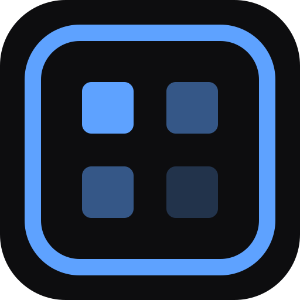

<div align="center">



# ASIS

**A**nnotate **S**creenshot **I**n **S**econds

[](https://github.com/KimKyuHoi/ASIS/releases)
[](https://github.com/KimKyuHoi/ASIS/releases)
[](https://www.electronjs.org/)
[](https://react.dev/)
[](https://www.typescriptlang.org/)
[](LICENSE)

macOS에서 화면을 캡처하고, 즉시 주석을 달아 공유하는 데스크탑 툴

[**다운로드**](#-설치) · [**기능 살펴보기**](#-기능) · [**단축키**](#️-단축키) · [**개발 환경 설정**](#-개발-환경-설정)

</div>

---

## ✨ 기능

> 캡처 → 주석 → 공유까지, 앱 전환 없이 한 흐름으로

| 도구              | 설명                                 |
| ----------------- | ------------------------------------ |
| 🖱️ **선택**       | 그려진 요소 선택·이동·크기 조절·회전 |
| ▭ **사각형**      | 색상 변경·회전 지원                  |
| ○ **원**          | 색상 변경·회전 지원                  |
| ➜ **화살표**      | 방향 표시, 색상·회전 지원            |
| ✏️ **펜**         | 자유 드로잉, 굵기 6단계·색상 변경    |
| 🖍 **하이라이트** | 기본 노란색, 색상 변경 가능          |
| 🌫 **블러**       | 민감 정보 가리기, 블러 강도 6단계    |
| 🔤 **텍스트**     | 폰트 선택, 색상 팔레트               |

### 그 외

- 🎬 **GIF 녹화** — 화면 영역을 GIF로 내보내기
- 🖥 **다중 디스플레이** — 여러 모니터 환경 완벽 지원
- ⏱ **지연 캡처** — 원하는 딜레이 후 자동 캡처
- 🗂 **Z-order 컨텍스트 메뉴** — 요소 앞뒤 순서 조정
- 📋 **클립보드 복사** — 바로 붙여넣기 가능

---

## 📥 설치

[Releases 페이지](https://github.com/KimKyuHoi/ASIS/releases)에서 최신 버전을 다운로드합니다.

```
ASIS-x.x.x-arm64.pkg   # Apple Silicon (M1/M2/M3/M4)
ASIS-x.x.x-x64.pkg     # Intel Mac
```

> **Gatekeeper 경고가 뜨는 경우**
> `시스템 설정 > 개인 정보 보호 및 보안`에서 실행을 허용하거나,
> 터미널에서 아래 명령을 실행하세요.
>
> ```bash
> xattr -d com.apple.quarantine /Applications/ASIS.app
> ```

### 필요 권한

앱 최초 실행 시 아래 권한을 요청합니다.

| 권한                        | 용도             |
| --------------------------- | ---------------- |
| 화면 녹화                   | 캡처 및 GIF 녹화 |
| 손쉬운 사용 (Accessibility) | UI 자동 감지     |

---

## ⌨️ 단축키

| 단축키    | 동작           |
| --------- | -------------- |
| `⌥ Space` | 캡처 시작      |
| `V`       | 선택 도구      |
| `R`       | 사각형         |
| `O`       | 원             |
| `A`       | 화살표         |
| `P`       | 펜             |
| `H`       | 하이라이트     |
| `B`       | 블러           |
| `T`       | 텍스트         |
| `⌘Z`      | 실행 취소      |
| `⌘⇧Z`     | 다시 실행      |
| `Delete`  | 선택 요소 삭제 |
| `ESC`     | 캡처 취소      |

---

## 🛠 개발 환경 설정

### 요구 사항

- **Node.js** 20+
- **pnpm** 10+
- **macOS** (main process가 macOS 전용 API 사용)
- **Docker** (Hermes 메모리 서버 실행 시)

### 설치 및 실행

```bash
# 의존성 설치
pnpm install

# 개발 서버 실행 (Hermes 메모리 서버 포함)
pnpm dev

# 앱만 실행 (Hermes 없이)
pnpm dev:app
```

### 빌드

```bash
# 타입 검사 + 린트 + 빌드
pnpm build

# macOS .pkg 패키징
pnpm build:mac
```

### 기타 명령어

```bash
pnpm typecheck      # TypeScript 타입 검사
pnpm lint           # ESLint 검사
pnpm lint:fix       # ESLint 자동 수정
pnpm changelog      # CHANGELOG 생성
```

---

## 🏗 기술 스택

| 레이어        | 기술                                                                                      |
| ------------- | ----------------------------------------------------------------------------------------- |
| 프레임워크    | [Electron](https://www.electronjs.org/) + [electron-vite](https://electron-vite.org/)     |
| UI            | [React 19](https://react.dev/) + [React Compiler](https://react.dev/learn/react-compiler) |
| 언어          | [TypeScript 5](https://www.typescriptlang.org/)                                           |
| 캔버스        | [Konva](https://konvajs.org/) / [react-konva](https://konvajs.org/docs/react/)            |
| 상태 관리     | [Zustand](https://zustand-demo.pmnd.rs/)                                                  |
| 메모리 서버   | Hermes (Docker)                                                                           |
| 패키지 매니저 | [pnpm](https://pnpm.io/)                                                                  |

---

## 🤝 기여

버그 리포트, 기능 제안, Pull Request 모두 환영합니다.

1. 이 저장소를 Fork합니다
2. 피처 브랜치를 만듭니다 (`git checkout -b feat/amazing-feature`)
3. 변경사항을 커밋합니다 ([Conventional Commits](https://www.conventionalcommits.org/) 형식)
4. 브랜치에 Push합니다
5. Pull Request를 열어주세요

---

## 📄 라이선스

[MIT License](LICENSE) © 2025 [KimKyuHoi](https://github.com/KimKyuHoi)

---

<div align="center">

Made with ❤️ on macOS · [**⬆ 맨 위로**](#asis)

</div>
